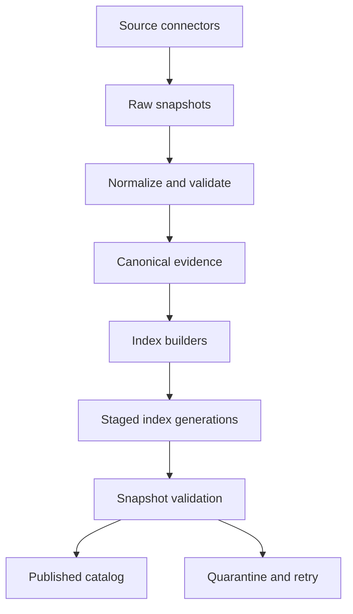
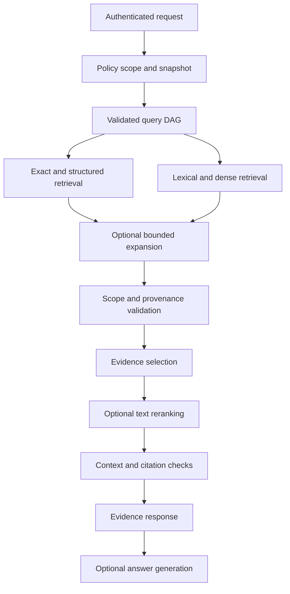

# Multidomain Evidence Retrieval Runtime — Revised Architecture and Implementation Plan

**Repository:** `noot515/cti-rag`  
**Revision:** 2.0 — 2026-09-22  
**Domains:** cybersecurity, networking, quantitative finance, privacy/counter-OSINT, humanities  
**Status:** proposed architecture; implementation and performance gains remain unverified.

This revision supersedes the attached plan. It preserves its multidomain scope, evidence-first design, existing-backend reuse, deterministic fixtures, and incremental migration while strengthening modularity, retrieval correctness, consistency, and evaluation.

**Review scope:** the supplied Markdown was reviewed in full. Its repository assessment refers to historical commit `15f4050a387bf41b8d77daf05e271ccfe9e522da`. Current repository access could not be verified during this review; file paths and existing implementation descriptions below are migration targets inherited from that assessment, not a fresh code audit. Phase 0 must establish the actual baseline. External references were checked on 2026-09-22. Proposed parameters are experiment starting points, not measured optimal settings.

## 1. Main findings and decisions

| Priority | Weakness in the original plan | Revised decision | Acceptance evidence |
| --- | --- | --- | --- |
| P0 | Phase 9 computes `filtered` but calls `reranker(fused)`; other diagrams filter only after reranking | Authorize before retrieval, validate before model exposure, recheck on response | Denied evidence never reaches reranker, generator, cache response, or caller-visible trace |
| P0 | RuntimePolicy hooks arrive after private-domain work | Define a local authorization port in the foundation; add external integration independently | Private domain cannot activate without a working policy implementation |
| P0 | Object identity conflates logical objects, revisions, and derived representations | Separate object, revision, passage, representation, and retrieval-hit identities | Updating a source preserves old citations and creates a new revision |
| P0 | Separate stores can expose partially updated evidence | Publish coherent corpus snapshots through an atomic metadata pointer | Crash during indexing cannot publish mixed generations |
| P0 | `available_at <= t` alone is described as preventing look-ahead | Distinguish historical public knowledge from historical system replay; filter every relevant artifact | Revised data, derived summaries, edges, and mappings cannot enter an earlier snapshot |
| P1 | DomainAdapter owns parsing, normalization, planning, and backend execution | Use small ports and domain specifications; backend adapters own execution | A new domain requires no orchestrator/fusion edits |
| P1 | Most channels default on for every query | Use validated, budgeted query DAGs and task-specific routes | Exact and numerical queries avoid unnecessary model calls |
| P1 | A wrapper around candidate BM25 is left as a production option | Require an independent persistent corpus index | Lexical search finds a relevant passage absent from dense candidates |
| P1 | Arbitrary RRF weights imply exact results will dominate | Hard identifier constraints and required evidence are separate from relevance ranking | Wrong-ID neighbors cannot displace a valid exact answer |
| P1 | Graph paths risk being interpreted as established conclusions | Preserve assertion-level provenance and relation semantics | No CVE-to-technique claim is inferred solely from ontology connectivity |
| P1 | One generic reranker processes heterogeneous results | One optional text reranking stage; structured results use typed verification | Correct calculations survive ranking and remain reproducible |
| P1 | Evaluation enumerates metrics without release gates | Frozen fixtures, real retrieval benchmarks, ablations, confidence intervals, and failure gates | Promotion requires measured benefit without correctness regressions |
| P2 | Additional infrastructure may be added before need is demonstrated | Modular application first; optional services and backends by capability | Deploy the text MVP without graph, web, or OpenCTI |

The objective is **the smallest auditable retrieval pipeline that returns sufficient, authorized, temporally appropriate evidence for the question**. More retrieval channels, graph edges, or context tokens are not automatically improvements.

## 2. System boundaries and architecture

Use a modular application with an API process and ingestion workers. Keep current databases where useful; avoid introducing a microservice for every module. Separate the ingestion path, serving path, and control functions.





The serving DAG may skip expansion or reranking. Numerical results have a typed verification path inside evidence selection; they are not converted into passages and allowed to vanish under text ranking.

Control functions provide schema versions, source manifests, policy decisions, snapshot publication, model registry, budgets, and evaluation. A planner cannot broaden authorization. An LLM may propose a plan or synthesize an answer, but cannot become the identity authority, numerical execution engine, or source of policy grants.

### Dependency rules

1. Contracts depend on the standard library and schema validation only.
2. Domain specifications depend on contracts, not Milvus, Neo4j, web clients, or LLM SDKs.
3. Application orchestration depends on ports, not concrete database implementations.
4. Infrastructure implements ports and owns backend-specific query compilation.
5. Composition roots select implementations and credentials explicitly.
6. Model-generated text and retrieved text are untrusted data; neither changes executable routing or permissions directly.
7. Tests enforce these import boundaries and run a minimal installation without optional backend SDKs.

## 3. Repository organization and migration map

Create new boundaries beside the legacy implementation; move files only when a compatibility layer is tested.

```text
packages/
  contracts/
    evidence.py identity.py temporal.py provenance.py
    query.py candidate.py policy.py errors.py manifests.py
  ports/
    source.py evidence_store.py search.py graph.py structured.py
    policy.py models.py snapshot_catalog.py
  application/
    ingest.py publish_snapshot.py plan_query.py execute_query.py
    fuse.py select_evidence.py pack_context.py verify_citations.py
  domains/
    registry.py
    cyber/ networking/ quant/ privacy/ humanities/
      spec.py schemas.py identifiers.py normalizers.py
      query_templates.py relation_rules.py fixtures/
  infrastructure/
    metadata_mysql/ object_store/ milvus/ lexical/ neo4j/ duckdb/
    model_providers/ queue/ web/ runtimepolicy/ opencti/
  composition/
    settings.py capabilities.py bootstrap.py
  core/
    retriever.py                 # compatibility facade during migration
rag/
  api/                          # existing API + evidence endpoint
  mq/                           # existing worker entry points
configs/
  sources/ domains/ retrieval_profiles/ deployment_profiles/
tests/
  contracts/ unit/ integration/ e2e/ adversarial/
benchmark/
  corpora/ queries/ qrels/ manifests/ reports/
```

Directory names are proposed; fit them to the actual packaging layout found in Phase 0.

| Existing component reported by original plan | Migration role |
| --- | --- |
| `packages/core/knowledgebase.py` | Milvus adapter behind SearchPort; keep legacy behavior under its flag |
| `packages/core/bm25_retriever.py` | Legacy regression reference; replace candidate-only retrieval with corpus search |
| `packages/core/graphbase.py`, `graph_indexer.py` | Graph adapter; versioned assertion indexing |
| `entity_extractor.py`, `entity_candidate_index.py` | Optional extraction/linking providers behind explicit contracts |
| `packages/models/rerank_model.py` | Model provider used only by the application ranking stage |
| `packages/manager/*` | Reuse persistence connections; add catalog and transactional outbox |
| `rag/api/*`, `rag/mq/*` | Keep transport boundaries; delegate application logic |
| `benchmark/query_test.py` | Preserve B0 baseline; add versioned evaluation harness |

Avoid two competing orchestrators. The old retriever delegates either to the legacy path or the new application based on a feature flag.

## 4. Small interfaces and capability negotiation

Replace the large DomainAdapter with separately testable interfaces.

| Interface | Responsibility | Must not own |
| --- | --- | --- |
| SourceConnector | Enumerate/fetch upstream snapshots, cursors, deletions | Ranking or canonical truth |
| Normalizer | Convert one supported source format into typed evidence | Publishing indexes |
| DomainSpec | Identifier namespaces, schemas, relation semantics, query templates, evaluation cases | Direct backend clients |
| SearchPort | Exact, lexical, or dense ranked hits within scope | Answer generation |
| GraphPort | Bounded traversal returning supported assertion paths | Unrestricted generated Cypher |
| StructuredPort | Compile validated query specifications and return typed results | Arbitrary model SQL |
| EvidenceStore | Hydrate immutable revisions and source locators | Retrieval scoring |
| PolicyPort | Resolve authorized scope and permitted processing destinations | Relevance or truth scoring |
| SnapshotCatalog | Resolve immutable corpus/index manifests | Source normalization |
| ModelPort | Embeddings, reranking, optional extraction/generation | Implicit network access or policy decisions |

A backend capability descriptor includes supported filters, temporal modes, score direction, pagination, cancellation, snapshot support, model fingerprint, language coverage, and maximum batch sizes. Unsupported required constraints cause rejection or an explicitly permitted alternate route; they are never silently ignored.

Use discriminated candidate payloads: `PassageHit`, `EntityHit`, `GraphPathHit`, and `StructuredResult`. Share a minimal envelope while retaining payload-specific validators. Do not force a table or graph path into a required `text: str` field.

All asynchronous retrieval operations accept a deadline, cancellation token, immutable scope, snapshot manifest, and candidate budget. Channel results distinguish `ok`, `empty`, `timeout`, `unavailable`, `unsupported`, and `rejected`.

## 5. Canonical evidence and identity

The source lake and normalized evidence store are authoritative for what the system has ingested. Search indexes are rebuildable projections. Source authority remains distinct from factual correctness.

### Identity hierarchy

Use a versioned, canonical serialization with explicit namespaces before hashing; do not concatenate unescaped fields with colons.

| Identity | Meaning | Suggested derivation |
| --- | --- | --- |
| `object_uid` | Logical upstream object | Hash of source namespace, upstream object type, stable upstream ID |
| `revision_uid` | Immutable observed revision | Hash of object UID, upstream version, raw payload digest, identity-relevant metadata digest |
| `artifact_uid` | Normalized representation | Hash of revision UID, parser/normalizer/schema versions, normalized payload digest |
| `passage_uid` | Citable passage in that artifact | Hash of artifact UID, chunker version, stable source locator, passage digest |
| `representation_uid` | Indexed vector or lexical representation | Hash of passage UID, model/tokenizer/analyzer/prefix fingerprints |
| `assertion_uid` | One sourced relation or claim | Hash of source revision, endpoints, predicate, qualifiers, supporting locators |

Retrieval attempts have separate request/hit IDs. Repeated downloads of the same revision append retrieval observations without changing evidence identity. Revised metadata affecting interpretation must create a new revision or explicit metadata revision. Upstream objects without stable IDs need a connector-specific location key and reconciliation policy.

Content equivalence is not identity equivalence. Identical text in two archives retains two provenance records. Do not deduplicate different editions, translations, filing amendments, or market-data vintages into one source.

Prefer full deterministic string primary keys for new Milvus schemas: Milvus supports `VARCHAR` primary keys. This avoids a special truncated-integer collision workflow. If a legacy adapter requires INT64, use a persistent unique mapping with explicit collision resolution; detecting a collision alone is insufficient. [Milvus primary fields](https://milvus.io/docs/v2.5.x/primary-field.md)

### Required evidence fields

```yaml
schema_version: evidence/2
object_uid: "..."
revision_uid: "..."
artifact_uid: "..."
domains: [cybersecurity]
artifact_type: document
source_id: "..."
source_object_id: "..."
source_uri: "..."
raw_digest: "..."
normalized_digest: "..."
locator: {kind: json_pointer, value: "/description"}
lineage: {parents: [], transformation_run_id: "..."}
temporal:
  published_at: null
  available_at: null
  available_at_basis: unknown
  first_observed_at: "..."
  valid_from: null
  valid_to: null
  recorded_from: "..."
  recorded_to: null
policy:
  tenant_id: "..."
  access_label: public
  processing_class: local_or_approved_remote
  license_id: "..."
  retention_class: "..."
epistemic:
  kind: source_claim
  model_generated: false
  extraction_confidence: null
  identity_confidence: null
```

Use UTC instants for known timestamps and separate representations for date-only, approximate, or uncertain historical dates. Never turn unknown times into zero or invent precise publication times. Use typed domain extension schemas instead of unlimited metadata fields. Confidence values require a documented meaning, calibration provenance, and optional value; there is no universal scalar truth score.

A citation identifies an immutable revision plus source locator, not merely a URL or mutable object UID. Locators include page/bounding box, character range, JSON Pointer, TEI XPath, canonical passage ID, or stable table row key. Preserve raw and normalized text alignment when OCR cleanup changes characters.

## 6. Temporal correctness and revisions

Three time concepts must remain separate:

- **Valid time:** when the assertion or observation applies in the world.
- **Availability time:** when that revision was publicly or otherwise legitimately available to the intended observer.
- **System time:** when this runtime recorded and served it.

Support these named modes:

| Mode | Eligibility |
| --- | --- |
| Current evidence | Latest eligible revision according to the source's revision rules and freshness requirements |
| Historical public knowledge | Revision available by the decision time; later ingestion permitted only with trustworthy historical availability evidence |
| Historical system replay | Use the actual historical corpus/model/configuration manifest and revisions served by that system at that time |

For historical public knowledge at cutoff \(t\), the basic predicate is:

$$
\operatorname{eligible}(r,t)=\operatorname{authorized}(r)\land\operatorname{available\_at}(r)\le t.
$$

This is necessary but not sufficient for an unbiased retrospective experiment. Select the correct revision per object/observation key, apply requested valid-time conditions, and keep unknown availability out of strict mode unless a documented conservative bound is available.

Derived summaries, embeddings, extracted edges, entity mappings, and statistical features retain dependency lineage. Their evidence dependencies must satisfy the same cutoff. A newly extracted summary can describe old public information, but cannot be claimed to have existed in a historical system replay.

Strict retrospective experiments also record index training, BM25 statistics, entity-resolution data, model training-cutoff knowledge when known, and tuning data. Future corpus statistics or future-trained models can change rankings even if returned documents pass a date filter. Label replay claims accordingly; do not claim all look-ahead is eliminated by one SQL predicate.

For finance, preserve observation period, vintage, currency, unit, reporting basis, timezone, corporate-action adjustment, issuer/security identity, and availability basis. Tickers require exchange and validity interval; they are aliases, not permanent company identifiers.

## 7. Ingestion, consistency, deletion, and recovery

Retain Bronze/Silver/Gold:

- Bronze: original bytes and retrieval observations, subject to retention and deletion policy.
- Silver: validated, immutable normalized artifacts and source assertions.
- Gold: vectors, lexical postings, graphs, structured views, and optional summaries.

Treat immutability as version integrity, not indefinite retention of sensitive material.

### Publication protocol

1. Fetch bounded input; record connector cursor, checksums, license, access labels, and source snapshot.
2. Normalize and validate; quarantine invalid objects with structured error reasons.
3. In one metadata transaction, commit canonical references and outbox events.
4. Workers consume events at least once; writes are idempotent by artifact/generation key.
5. Build staged projections. Record exact evidence revision sets, model fingerprints, counts, deletions, and checksums.
6. Validate referential integrity, temporal fields, retrieval probes, and required backend readiness.
7. Atomically publish one catalog manifest pointing to compatible immutable index generations. Requests pin that manifest at admission.
8. Retain old generations until pinned readers finish and retention permits cleanup.

Do not assume a distributed transaction across MySQL, Neo4j, Milvus, and Parquet. The metadata catalog is the publication authority. Individual backend readiness includes visibility to serving readers, not just an acknowledged write. Backend aliases alone cannot atomically publish the whole runtime.

Initially build complete small generations. At scale, use immutable segments and manifest membership or versioned rows to avoid full rebuilds; prove the same visibility contract before enabling incremental publication. Never mix latest lexical results with an older vector or graph generation without an explicitly declared compatible revision set.

Revocations and deletions update an immediately checked deny/tombstone overlay, invalidate caches, and schedule removal from every projection and derived artifact. Even an old pinned snapshot must honor current authorization revocation. Historical replay remains subject to present access rights.

Use retry limits, dead-letter queues, resume cursors, and backpressure. A poison record must not block an entire source indefinitely. Snapshot manifests report quarantined counts and coverage gaps. Backups include metadata, raw/normalized objects, manifests, secrets recovery procedures, and a tested restore path; rebuildable indexes can be regenerated.

## 8. Index layout and backend decisions

Retain MySQL for operational metadata initially. Do not add PostgreSQL simply to rename the metadata layer. Use DuckDB over approved Parquet snapshots for analytical computation, Milvus for semantic retrieval, and Neo4j only where relationship workloads justify it. Redis, RabbitMQ, MinIO, and Etcd remain deployment dependencies only where the chosen profile requires them.

Independent retrieval does not require separate physical services. Milvus documents corpus BM25 search using a sparse inverted index; evaluate that as the first lexical adapter if the pinned deployment supports required analyzers, filtering, and lifecycle operations. [Milvus full-text search](https://milvus.io/docs/full-text-search.md)

| Lexical option | Use when | Tradeoff |
| --- | --- | --- |
| Milvus BM25 | Existing deployment passes lexical/filter/snapshot contract tests | Fewer services; dense and lexical share an outage domain |
| Dedicated inverted-index backend | Multilingual analysis, field control, operational isolation, or measured recall requires it | More synchronization and operations |
| Small in-process BM25 | Deterministic fixtures and diagnostic baselines | Not the production large-corpus search implementation |

Pin actual server/client versions and test capabilities; the current documentation does not prove that the historical repository deployment has these features.

Partition primarily by security boundary, embedding compatibility, language/analyzer requirements, and lifecycle. Domain is an explicit filter; avoid creating a collection for every source or every small domain by default. Physically separate private exposure state where possible. Different vector dimensions, tokenization, pooling, distance metrics, or embedding revisions require separate compatible spaces.

Metadata indexes must support source, access scope, domain, revision/snapshot, entity IDs, language, and temporal constraints. Apply filters within search, not just to the final top-k. Milvus provides filtered search, but the adapter must prove the exact scope semantics required here. [Milvus filtered search](https://milvus.io/docs/filtered-search.md)

For very selective scopes, choose an exact vector scan or approved alternate route when it improves correctness/latency. Measure approximate-nearest-neighbor recall against exhaustive search on a representative authorized sample.

## 9. Parsing, chunking, and representation quality

Retrieval optimization begins before indexing.

1. Preserve document structure: headings, sections, tables, code blocks, footnotes, references, and source coordinates.
2. Use structure-aware passages and parent-child links. A starting text experiment is 250–500 tokens with limited overlap; select sizes per corpus using recall and context cost.
3. Keep tables structured with column names, units, row keys, footnotes, and filing/edition context. Do not flatten away headers.
4. Keep original text for quotation. Store OCR-normalized or spelling-normalized variants separately, with alignment and confidence.
5. Index identifiers as exact keyword fields as well as search text. Preserve punctuation meaningful to CVEs, hashes, versions, IPs, CIDRs, and code symbols.
6. Use domain/language analyzers. Retain the original query when using translated or expanded query variants.
7. Add deterministic context prefixes such as document title, section, entity, date, and edition. Keep them separate from quoted source text.
8. Consider model-generated contextual prefixes only after the deterministic baseline. Record the source dependencies and model/prompt revision and exclude the synthetic prefix from quotations.

Contextual retrieval is an empirical option for passages that lose document context; published results motivate a local ablation rather than a promised gain on these five domains. [Anthropic contextual retrieval](https://www.anthropic.com/engineering/contextual-retrieval)

Do not embed every raw telemetry row, price tick, or duplicate document. Select textual artifacts and meaningful summaries; retain high-volume numerical/event records in structured storage. Embedding caches use content plus model/tokenizer/prefix fingerprints and security namespace.

## 10. Query planning as a bounded DAG

The planner emits a validated plan, not arbitrary tool code. A typed schema does not itself make LLM planning deterministic; record planner model, prompt, output, and configuration when used.

Required plan fields:

```yaml
plan_version: query/2
original_query: "..."
normalized_query: "..."
intent: evidence_synthesis
requested_domains: [cybersecurity, networking]
resolved_identifiers: []
constraints: {language: null, source_ids: [], temporal_mode: current}
subquestions: []
nodes: []
budget:
  deadline_ms: 3000
  max_backend_calls: 8
  max_expansion_rounds: 1
  max_total_candidates: 240
  max_rerank_candidates: 60
  max_context_tokens: 8000
```

The 3-second budget is an initial local interactive target to benchmark, not a guaranteed service level. Graph and analytical profiles may need larger explicitly selected budgets. All client budgets are bounded by server limits.

Authenticated scope and snapshot references are server-derived fields added after admission; the client cannot supply its own effective principal, clearance, or policy grant.

Planning order:

1. Parse deterministic identifiers, dates, units, requested sources, and explicit domains.
2. Resolve ambiguous identifiers using namespace and temporal constraints. Preserve uncertainty when multiple entities remain.
3. Select a task template and required evidence obligations.
4. Use an optional model only for unresolved semantic decomposition.
5. Validate allowed operations, dependencies, source capabilities, policy scope, and total budgets.
6. Run independent DAG nodes concurrently; run dependent joins after their inputs exist.

| Task | Default route | Optional extension |
| --- | --- | --- |
| Exact object/identifier lookup | Exact index and source revision store | Supporting passages |
| Numerical aggregation | Structured query | Text explaining definitions |
| Explanatory question | Lexical + dense in parallel | Entity-seeded graph expansion |
| Known relation question | Exact entity resolution + graph | Supporting original passages |
| Cross-domain question | Subquestion DAG + typed joins | Bounded follow-up for uncovered subquestions |
| Source criticism | Lexical + dense across relevant source classes | Contradiction and edition comparison |

Domain routing is multi-label. If confidence is low, search a small authorized fallback scope rather than silently excluding all other domains. Measure router recall against a broader-search oracle. Cap query rewrites and normalize their contribution so creating more rewrites cannot manufacture ranking votes.

## 11. Exact and structured retrieval

An explicit valid identifier becomes a constraint or a required evidence obligation. Exact matching establishes identity, not truth or source completeness. A report that merely mentions a CVE is not the canonical CVE record.

For numerical questions, execute a typed specification with allowlisted datasets, fields, joins, operators, and functions. Parameterize values and compile identifiers from schema-controlled names. Parameterization alone does not validate table names, file paths, or functions.

Return a `StructuredResult` containing dataset snapshot, query-spec hash, units, typed values, null/missingness rules, temporal selection, row lineage or a reproducible input-set manifest, and calculation version. Scanning and aggregation budgets are distinct from output row limits. A count over 50 returned rows is not a full-corpus count.

DuckDB workers use approved views/paths, resource limits, restricted extension loading, locked configuration where appropriate, and restricted OS access. DuckDB supports filesystem access and requires deliberate controls; read-only SQL alone is insufficient. For direct Parquet access use narrowly allowlisted snapshot paths, or preloaded tables with external access disabled. [DuckDB security documentation](https://duckdb.org/docs/current/operations_manual/securing_duckdb/overview)

Reject unknown units, incompatible calendars, and ambiguous joins. For event studies, record benchmark, estimation window, event window, return definition, missing-data treatment, and corporate-action handling. Label associations as associations; retrieval does not establish causation or trading profitability.

## 12. Hybrid retrieval and fusion

Lexical and dense search operate independently over eligible corpora. Merge duplicate hits by citable passage identity, preserving the source ranks and representation IDs. Do not merge graph paths and text passages just because they mention the same entity.

For homogeneous passage pools, start with equal-weight reciprocal rank fusion:

$$
S(d)=\sum_{c\in C_d}\frac{w_c}{k+r_c(d)},\qquad k=60,\quad w_c=1.
$$

Here \(r_c\) is a 1-based rank in a bounded, deduplicated channel list. Missing candidates contribute zero. Use stable UID tie-breaking. Raw dense, lexical, and graph scores are not directly comparable, and an RRF score is not a probability of correctness. RRF combines independently ranked lists; candidate window size changes which candidates can participate. [Elasticsearch RRF documentation](https://www.elastic.co/docs/reference/elasticsearch/rest-apis/reciprocal-rank-fusion)

Use grouped fusion: combine query variants within a channel, then combine channels. Bound each channel's total contribution. Rank within subquestions before selecting evidence across them, so the largest corpus does not consume the whole result budget.

Do not feed arbitrary structured row order into RRF. Exact canonical records and required numerical outputs are maintained as verified evidence obligations. Graph paths have their own validity and relevance assessment and yield source-backed passages or typed paths for the packer.

Tune weights only on a development set. The original exact=1.30 and graph=1.10 weights lack demonstrated justification and cannot enforce identity constraints. Start with dense/lexical top-50, union cap 120 per simple text query, and at most 60 rerank inputs; constrain the total request budget across all subquestions.

## 13. Graph retrieval and entity resolution

Model a distinction between entities and assertions about entities. A statement such as “Company A owns Domain B” needs its own source, valid interval, availability, epistemic label, and supporting passage. Use assertion nodes or equivalently versioned edge records; preserve conflicting sources separately.

Canonical entity keys contain type and namespace. DOI, CVE, ASN, CIK, ORCID, and ISBN identify different kinds of objects and must not all become interchangeable GlobalEntity identifiers. Legal entities, securities, people, works, editions, and network resources stay distinct.

Store identity links as sourced assertions: `confirmed_same_entity`, `possible_same_entity`, `alias_of`, `issued_by`, or another typed relation. Do not take the transitive closure of probabilistic matches as confirmed identity. Preserve merge/split history and reversible resolution decisions.

Graph expansion requires:

- Authorized seeds from identifier resolution or retrieved evidence.
- Relation allowlists, directed semantics, node-type constraints, and temporal compatibility.
- Initial caps of 2 hops, 8 seeds, 20 neighbors per node, 100 returned paths, plus a total examined-edge budget and deadline.
- Cycle detection and hub suppression.
- Provenance for every exposed edge and a resolvable support artifact.
- Explicit `truncated` status when any traversal cap prevents completeness.

A CVE→CWE→CAPEC→ATT&CK chain is a potential ontology connection, not proof that a specific exploit used a technique. BGP announcement does not prove ownership; shared infrastructure does not establish attribution. Extraction confidence and path relevance are not causal probabilities. Do not multiply edge confidence values unless the probabilistic assumptions have been justified.

Public projections must not expose private bridge nodes, paths, hidden-node counts, or private identity aliases. Authorization applies to traversal itself and to supporting evidence, not just the final endpoint.

## 14. Reranking, evidence selection, and context packing

Use one centrally owned optional text reranking stage in the initial architecture. Exact responses and verified numerical responses can bypass it. The benefit is clear ownership and measurable cost, not a claim that multiple-stage ranking is always invalid.

Build the reranking pool with sufficient subquestion coverage and reserved supporting/conflicting candidates. Avoid aggressive diversity pruning before relevance assessment. Score authorized passage content only; keep graph/structured payloads typed while providing bounded display text if useful.

After ranking, select evidence for relevance, coverage, and nonredundancy:

$$
\max_{S\subseteq C}\left[\sum_{e\in S}u(e)+\lambda\,\operatorname{coverage}(S)-\mu\,\operatorname{redundancy}(S)\right]
$$

subject to the token budget, authorization, temporal validity, provenance completeness, and required evidence obligations. This is a design objective; start with a deterministic greedy implementation and compare against a simple top-k baseline.

Detect syndication and common upstream origin. Ten copies of one press release do not provide ten independent corroborations. Keep origin groups without discarding distinct archival provenance. Use task-appropriate source preferences and freshness, not an unconditional bonus for newest or official documents.

Context packing must:

1. Use the actual generator tokenizer and reserve tokens for instructions, tools, and output.
2. Include source revision, locator, epistemic label, relevant date, and unit information.
3. Expand passage parents only within the same authorized snapshot and budget.
4. Keep numeric tables and graph paths in typed, minimally lossy representations.
5. Preserve contradictions and distinguish evidence absence from a negative finding.
6. Recheck citations after truncation and any compression.
7. Return `insufficient_evidence` or `partial` when required evidence cannot fit or was not found.

Do not assume an 8,000-token context is better than 4,000. Evaluate size and ordering on the actual model; prior long-context research found sensitivity to where relevant material appears. [Lost in the Middle](https://arxiv.org/abs/2307.03172)

## 15. Claim grounding, contradiction search, and abstention

Separate retrieval from answer generation. A valid citation pointer proves source existence, not support for every claim made about it.

For important synthesized claims, record `claim -> supporting span(s)`, optional conflicting spans, and status: supported, contradicted, mixed, or insufficient. Validate exact identifiers, quoted text, numbers, and source coordinates deterministically. Use semantic entailment models only as fallible checks with evaluated error rates.

Trigger one bounded follow-up retrieval for missing required support or a task explicitly requesting competing accounts. Preserve the original query and authorized scope. Model-generated hypotheses may guide searches but never become retrieved evidence.

For conflicting sources, check whether entity identity, event time, unit, edition, or revision explains the difference before labeling contradiction. Distinguish source assertion from model inference. Avoid a single answer-confidence score until it is calibrated against held-out cases.

Measure answerable coverage and error rate jointly. An always-abstaining system is not a successful retrieval system. Unsupported claims should be removed, qualified, or returned as unresolved rather than made persuasive through citations.

## 16. Authorization, privacy, and RuntimePolicy integration

Policy is foundational. An external RuntimePolicy service is an adapter, not a prerequisite for defining or testing scope enforcement.

Policy decisions cover principal/tenant, source and domain access, private-state permission, purpose, markings, retention, and permitted model/network destinations. A local reranker and a remote reranker are different exposure destinations. The same applies to query embeddings, extraction, translation, and answer generation.

Apply scope at backend search/traversal, canonical hydration, remote model dispatch, caching, packing, and final response. Final response validation uses the current policy epoch so revocation can take effect during a long request. Do not return denied candidate counts or titles in public traces.

The following pseudocode specifies control flow; it is not a runnable API:

```python
async def retrieve(request, authenticated_principal):
    scope = await policy.authorize(request, authenticated_principal)
    snapshot = await catalog.pin_compatible_snapshot(scope, request.temporal)
    plan = planner.compile_and_validate(request, scope, snapshot)
    results = await executor.run(plan, scope, snapshot)
    safe = await evidence_validator.hydrate_and_validate(results, scope, snapshot)
    required, passages, paths = selection.partition_by_evidence_type(safe, plan)
    fused = fusion.rank_passages(passages, plan)
    ranked = await ranker.optional_rerank(fused, scope, plan.budget)
    bundle = packer.pack(required, ranked, paths, plan)
    citations.verify_locators_and_payloads(bundle)
    await policy.revalidate_for_response(bundle, authenticated_principal)
    return response.serialize_authorized(bundle, results.statuses)
```

The original unused-`filtered` defect is removed: every downstream component consumes validated authorized evidence. Optional answer generation is an additional authorized operation over the bundle.

When policy state cannot be established, protected data retrieval fails closed. Public-only operation is allowed only under an explicit local public-data rule. Model uncertainty cannot create a permission, and a relevance score cannot weaken one.

## 17. Web and external integration

Keep SearXNG and Tavily behind SearchProvider, and OpenCTI behind a cyber-specific source adapter. No `pycti` or web-provider client belongs in core orchestration. OpenCTI remains optional and read-first.

A search snippet is discovery metadata, not a fetched, verified source. Web evidence enters a request-local captured evidence set with fetch time and provenance; it becomes part of persistent corpora only through the normal ingestion publication path. Responses distinguish base snapshot evidence from this explicit live overlay. Offline evaluation disables the overlay entirely.

Fetch authorization and SSRF checks precede network requests and apply again to every redirect. Validate scheme, port, host resolution, IPv4/IPv6 ranges, and actual connection destination; block loopback, link-local, metadata services, and internal networks except explicit connector allowlists. Handle DNS rebinding and proxy behavior at the egress boundary.

Limit bytes, decompressed size, redirects, content types, parser time, and archive depth. Use isolated parsers for hostile formats. Minimize private terms before sending a search externally; private exposure data does not enter public search by default.

Retrieved instructions remain quoted evidence. Delimiters help representation but do not enforce security; tool authorization and model dispatch rules remain outside retrieved content.

## 18. Domain specifications and preserved source scope

### Cybersecurity

Retain ATT&CK, CWE, CAPEC, D3FEND, ATLAS, CAR, Attack Flow, CVE/NVD, GHSA, KEV, MISP, reports, TRAM, sightings, Sigma, Atomic Red Team, CVEfixes, MegaVul, PoC metadata, and SOC telemetry as candidate sources. Each needs availability, licensing, format, and update validation before activation.

Use exact/structured retrieval for identifiers, severity, versions, and KEV status; lexical/dense for reports; graph for explicitly sourced mappings. Preserve source-specific CVSS versions and disagreements. Large telemetry remains structured with selected summaries. Retrieved code and payloads are data, not automatically executable actions.

### Networking

Retain RFC/IETF text, BGP/RPKI, RIPE/RIR, DNS/RDAP, configurations, packet/event metadata, certificates, and topology. Use IP/CIDR-aware types and containment operations instead of string comparisons. Record collector/vantage point and observation intervals; distinguish observed origin, registration, validated authorization, and inferred ownership. Track RFC updates and obsoletions.

### Quantitative finance

Retain SEC/XBRL, FRED/ALFRED, prices, fundamentals, corporate actions, earnings material, filings, disclosures, and research. Numerical answers use structured execution with point-in-time revision selection. Document search supplies definitions and context. Historical universe membership and delisted securities matter to retrospective coverage; current membership is not a safe historical substitute.

### Privacy/counter-OSINT

Retain Privacy Guides, EFF SSD, W3C DPV, NIST Privacy Framework, Tracker Radar, EasyPrivacy, policy corpora, PrivacyQA, OPP-115, and broker catalogs. Public privacy knowledge and private exposure state use separate security scopes, model destinations, caches, and graph projections. Identity states remain confirmed, inferred, possible, stale, or removed. Retrieval returns the minimum relevant private subgraph.

### Humanities

Retain Gutenberg, Perseus, Chronicling America, BigLAM, DPLA, Europeana, museums, newspapers, TEI, and archives. Model work, edition, witness, translation, page/folio, and passage as typed relationships; the original linear hierarchy is not universally valid for all collections. Preserve IIIF/TEI locators, OCR quality, uncertain dates, language, rights, and the distinction between primary text, editorial annotation, scholarship, and interpretation. Source frequency in a digitized corpus is not automatically historical prevalence.

### Cross-domain example

For an incident and abnormal-return question: resolve the legal entity and security at the event time; retrieve the incident disclosure; retrieve source-backed network associations; compute the declared return statistic from a pinned market snapshot; then synthesize with separate citations for each step. Do not infer a causal market effect from co-occurrence. If a join remains ambiguous, return that ambiguity instead of a fabricated unified entity.

## 19. Latency, memory, caching, and cost

Optimize the measured bottleneck in this order: avoid unnecessary work, fix filters and indexes, batch, cache safely, tune candidate sizes, then consider more elaborate models.

- Skip LLM planning for exact and known analytical templates.
- Run independent lexical/dense work concurrently with bounded queues.
- Reserve interactive model capacity; schedule bulk embedding separately.
- Hydrate large source payloads only after candidate reduction, with canonical access checks.
- Batch embeddings/reranking within latency limits and cancel obsolete work.
- Avoid unrestricted graph traversal and unbounded cross-domain fan-out.
- Reuse indexed content only when representation fingerprints match.

Cache keys include normalized query, relevant original identifiers, principal/security namespace, effective scope hash, policy epoch, temporal mode/cutoff, snapshot ID, plan/configuration hash, model fingerprints, and locale. Private query embeddings and result caches stay scoped. Revocation invalidates cache entries independently of TTL. Negative caches need short, source-aware lifetimes and must distinguish empty from failed retrieval.

Record p50/p95 latency by stage, queue time, candidate counts, rejection reasons, cache hit rate, model tokens, index size, RAM/VRAM peak, and ingestion throughput. Raw queries/private snippets are not default telemetry fields. Keep traces access-controlled and retention-limited.

On a single-GPU host, benchmark retrieval with answer generation running concurrently. Do not size embeddings and rerankers from nominal GPU capacity alone. Deployment sizing is a Phase 0 measurement, not an assumption imported from another project.

## 20. API and deployment contracts

Retain existing endpoints. Add `POST /research/advanced-retrieval` for evidence retrieval; keep answer generation separately callable.

```json
{
  "query": "Which RFC explains this route-reflection behavior?",
  "domains": ["networking"],
  "temporal": {"mode": "current"},
  "response_mode": "evidence",
  "top_k": 10,
  "web_search": false,
  "retrieval_profile": "interactive"
}
```

The response contains a schema version, request/plan IDs, snapshot manifest reference, authorized evidence payloads, stable citations, channel statuses, safe coverage gaps, timings, and `status` of `complete`, `partial`, `insufficient_evidence`, or `failed`. Define complete relative to declared evidence obligations and configured source coverage, never universal knowledge completeness.

Debug traces are separately authorized. `top_k` limits returned presentation items, not every internal scan. Do not expose raw credentials, private graph topology, or unrestricted backend query strings.

Configuration profiles:

| Profile | Components |
| --- | --- |
| Unit/fixture | In-memory contract fakes and tiny local datasets |
| Text MVP | Metadata, source storage, independent lexical + dense, optional reranker |
| Domain analytical | Text MVP + DuckDB; Neo4j only for graph tasks |
| Full research | Domain analytical + approved web/OpenCTI/RuntimePolicy adapters |

Expose the API only by default. Use secrets, internal service networks, least privilege, supported read-only mounts, resource limits, and restricted outbound access. Avoid a blanket container setting that prevents a stateful backend from writing required files. Use a configurable data root; the previous Fedora paths may remain bind-mounted for migration rather than being hard-coded into application logic.

## 21. Evaluation design and promotion gates

Separate deterministic contract correctness, retrieval quality, and generation quality. Fake embeddings prove orchestration, not semantic retrieval performance.

Build small fixtures first, then a versioned real evaluation set with at least 50 initial queries per domain plus cross-domain and adversarial cases. This is a development starting point, not sufficient evidence for every production claim. Expand based on uncertainty and failure diversity. Use source-family and temporal splits, keep duplicate publications together, and hold test judgments outside indexed corpora. Freeze tuning before the final test.

Include exact IDs, paraphrases, rare terms, ambiguous names, versions, quotations, numerical filters, negation, missing evidence, conflicting claims, multilingual/OCR cases, historical revisions, and authorization boundaries. Human-review pooled judgments from multiple retrievers; do not assume every unjudged document is irrelevant. External heterogeneous benchmarks such as BEIR help test transfer but do not replace these domain-specific cases. [BEIR](https://arxiv.org/abs/2104.08663)

| Layer | Measures |
| --- | --- |
| Candidate generation | Recall@20/50/100, exact-ID success, relevant-source recall, router recall, ANN recall versus exhaustive search |
| Ranking/selection | nDCG@10, MRR, subquestion coverage, duplicate/origin concentration, evidence surviving packing |
| Graph | Supported path validity, required-edge recall, identity errors, traversal truncation |
| Structured | Expected values, units, joins, complete aggregation, revision/vintage correctness |
| Grounding | Citation existence, locator precision, claim support precision/recall, unsupported-claim rate |
| Abstention | Answerable coverage, false abstention, error among answered questions |
| Operations | p50/p95 latency, resource/cost usage, freshness lag, rebuild time, deletion propagation |
| Policy/time | Unauthorized exposure, forbidden model dispatch, future-revision leakage, stale-cache exposure |

Claim-level diagnostic frameworks can help separate retrieval failure from generation failure, but model-judged metrics need human spot checks and pinned judge versions. [RAGChecker](https://github.com/amazon-science/RAGChecker)

### Hard gates

Every release must pass all deterministic invariant fixtures: zero unauthorized disclosures, zero unresolved returned citations, zero known future-revision leaks in strict fixtures, correct exact/numerical results, correct snapshot publication, and idempotent ingestion. These are zero observed failures in a defined test suite, not proofs of zero real-world risk.

### Empirical gates

Predeclare candidate and latency budgets before comparing systems. Promote an optimization only if a paired, query-level evaluation shows a useful quality or cost improvement without violating hard gates. Suggested initial noninferiority margin: no more than 0.01 absolute loss in nDCG@10 or Recall@50 for any critical domain/task slice, assessed with paired bootstrap intervals. If intervals are too wide, collect more cases or report the result as inconclusive. A global mean cannot hide a failed privacy, temporal, identifier, or language slice.

### Baselines and ablations

Keep policy, snapshot, and evidence-validation controls constant across all new-system baselines:

| Run | Retrieval change |
| --- | --- |
| B0 | Captured legacy behavior on public fixture corpus only |
| B1 | Independent lexical |
| B2 | Dense |
| B3 | Lexical + dense, equal RRF |
| B4 | B3 + optional final text reranker |
| B5 | B4 + structure-aware context prefixes and parent expansion |
| B6 | B4 + bounded graph expansion |
| B7 | B4 + task routing and structured execution |
| B8 | Best validated combination + bounded contradiction search |

Run factorial comparisons where interactions matter; do not conclude that the final cumulative system proves every added feature helped. Benchmark latency at equal resource and candidate budgets. Tune ANN, chunking, reranker size, fusion weights, and domain routing separately before combining changes.

## 22. Failure semantics and adversarial fixtures

| Failure | Required behavior |
| --- | --- |
| Dense unavailable | Authorized lexical or other suitable routes; report missing semantic channel |
| Both dense and lexical share a failed backend | Do not claim independent operational fallback; return partial/failed as obligations require |
| Graph unavailable or capped | Mark required relation question incomplete; do not interpret as no relationship |
| Structured backend unavailable | No guessed numerical answer; return missing calculation |
| Reranker unavailable | Use fused passage ranking with explicit degradation |
| Required scope unsupported | Disable that backend/route; never search broadly and hope final filtering suffices |
| Missing provenance or mismatched revision | Reject candidate and record internal diagnostic |
| Publication interrupted | Continue serving prior compatible snapshot |
| New tombstone/revocation | Block current and cached exposure immediately; clean projections asynchronously |
| No relevant evidence | Return insufficient evidence; preserve distinction from backend failure |

Mandatory adversarial fixtures include: malicious document instructions; ID-like near matches; wrong-edition quotations; duplicate syndicated reports; source correction; future macro revision; ticker reuse; non-overlapping graph time intervals; fabricated graph supports; forbidden parent expansion; private bridge traversal; revoked cached results; timed-out analytical scan; redirect to internal IP; replayed indexing message; and a crash between the last index write and catalog publication.

## 23. Implementation sequence and chained validation

This sequence replaces the original 14 phases. Establish policy and a working text vertical slice before building every domain and integration.

| Phase / PR | Deliverable | Exit gate and inherited checks |
| --- | --- | --- |
| 0 — baseline | Verify actual repo SHA, instructions, dependencies, tests, service versions, data inventory; capture B0 and resource measurements | Reproducible baseline manifest; label not-run checks honestly |
| 1 — contracts | Identity/revisions, typed payloads, provenance/locators, temporal modes, errors, policy port | Stable identities; revision preservation; all schema and denial fixtures |
| 2 — canonical ingestion | Raw/normalized storage, source manifest, outbox, idempotent workers, catalog, tombstones | Replay/crash/restore tests + Phase 1 gates |
| 3 — text vertical slice | One small cyber source, exact lookup, independent lexical and dense adapters, filtering, snapshot publication | Dense miss recovered by lexical; no denied model input; citation resolves + prior gates |
| 4 — query pipeline | Budgeted planner, grouped RRF, optional reranker, parent expansion, context/citation checks, endpoint | E2E retrieval and no-evidence paths; B1–B4 report + prior gates |
| 5 — temporal and structured | DuckDB query compiler, networking containment fixture, quant revisions, numerical lineage | Full aggregation and point-in-time tests + prior gates |
| 6 — graph assertions | Canonical entities, supported paths, relation rules, bounded traversal | Source-backed cyber/network paths; temporal/ACL failures + prior gates |
| 7 — remaining domain fixtures | Private privacy isolation, humanities editions/OCR, source-specific semantics | Five-domain E2E and private cache/model-dispatch tests + prior gates |
| 8 — cross-domain DAG | Typed entity links, subquestions, joins, coverage, bounded contradiction follow-up | Incident/network/return fixture and ambiguity handling + prior gates |
| 9 — real source onboarding | Add sources in small batches; semantic model benchmarks and scale measurements | Per-source lifecycle tests, real qrels, snapshot reconciliation + prior gates |
| 10 — optional integrations | Hardened web, OpenCTI, external RuntimePolicy adapter | Interface conformance, injection/SSRF tests, offline independence + prior gates |
| 11 — measured optimization | Tune chunks, analyzers, ANN, ranking, routing, caching; optional new backends/models | Predeclared quality/latency gates and rollback rehearsal + full suite |

Source onboarding priority: ATT&CK/CVE/KEV and RFCs first; SEC/FRED/ALFRED plus a licensed price fixture next; public privacy policies/Tracker Radar and a small humanities corpus after their locators and semantics are proven. The remaining sources retain their place in the scope but are not required to bootstrap the runtime.

Every PR records parent baseline, own commit/config/model/corpus hashes, changed contracts, exact validation commands, results, known gaps, and benchmark deltas when applicable. Re-run foundational fixtures and affected integration suites at every phase; run the full accumulated suite before milestone promotion. Never substitute fake-model CI results for a claimed real-model improvement.

Offline CI uses deterministic fixtures without network access. Integration CI validates pinned stores. Real-model and GPU jobs are separate gates with explicit availability status. Keep existing tests; a feature flag does not excuse silent regressions in the legacy path.

## 24. Research options after the baseline

These remain experiments until ablations justify their cost:

| Option | Potential benefit | Main cost or risk | Promotion evidence |
| --- | --- | --- | --- |
| Learned sparse or late-interaction retrieval | Better difficult lexical/semantic matching | Larger indexes and deployment complexity | Gain over B4 at declared resource budget |
| Model-generated contextual prefixes | Better disambiguation of short passages | Ingestion cost and invented context | Recall gain; source text and historical eligibility preserved |
| Hierarchical summaries/community retrieval | Broad corpus-level synthesis | Summary staleness, provenance loss, expensive rebuilds | Global-question benchmark gain with traceable sources |
| Learned router/fusion | Task-specific allocation | Overfitting and hidden domain exclusion | Held-out per-domain gains and calibration |
| Adaptive multi-round retrieval | Fill missing support | Latency and confirmation bias | Improved supported coverage within fixed call budget |
| Separate lexical service | Analyzer flexibility and independent availability | Extra operations and consistency work | Measured retrieval or reliability need |

Do not introduce a universal knowledge graph, unrestricted agentic search loop, or new database merely because the interface could support one.

## 25. Definition of done and first action

The first useful release is a public-data text vertical slice with exact identity, independent lexical/dense retrieval, authorized scope, stable citations, coherent snapshots, bounded ranking, and measured baseline quality. The full multidomain milestone adds all five semantic fixtures, temporal/numerical correctness, graph support lineage, private-state isolation, and a cross-domain query that exposes missing evidence honestly.

Completion requires:

- All returned evidence belongs to an allowed scope and compatible declared snapshot or explicit live overlay.
- Every citation resolves to a preserved revision and locator, subject to authorized retention/deletion rules.
- Exact, lexical, dense, graph, and structured components satisfy independent contracts.
- Revision, deletion, reindexing, restoration, and rollback paths are tested.
- Numerical results are computed and reproducible; graph connections retain their evidentiary limits.
- Real-model retrieval quality and performance are reported by domain/task, with failed and inconclusive results visible.
- Optional services can be disabled without invalidating the core application.
- Legacy migration is reversible, and no benchmark labels enter retrieval indexes.

**Immediate implementation:** begin Phase 0, then add contracts for identity/revisions, policy scope, temporal eligibility, and typed candidates in one small PR. Follow with the canonical store and a single working cyber text retrieval path. This delivers an inspectable foundation before the source catalog and graph become large.